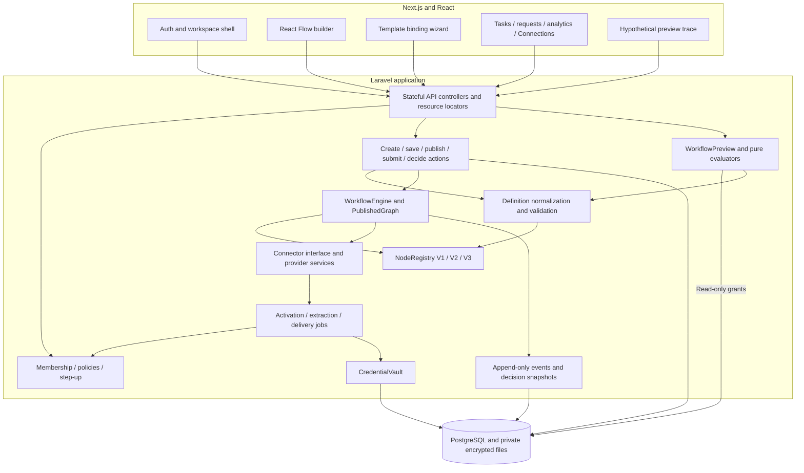

# Component architecture

```mermaid
flowchart TB
  subgraph Frontend[Next.js and React]
    Shell[Auth and workspace shell]
    Builder[React Flow builder]
    Library[Template binding wizard]
    Views[Tasks / requests / analytics / Connections]
    PreviewUI[Hypothetical preview trace]
  end
  subgraph Laravel[Laravel application]
    Routes[Stateful API controllers and resource locators]
    Policies[Membership / policies / step-up]
    Actions[Create / save / publish / submit / decide actions]
    Registry[NodeRegistry V1 / V2 / V3]
    Normalize[Definition normalization and validation]
    Engine[WorkflowEngine and PublishedGraph]
    Pure[WorkflowPreview and pure evaluators]
    Connectors[Connector interface and provider services]
    Jobs[Activation / extraction / delivery jobs]
    Audit[Append-only events and decision snapshots]
    Vault[CredentialVault]
  end
  Store[(PostgreSQL and private encrypted files)]
  Shell --> Routes
  Builder --> Routes
  Library --> Routes
  Views --> Routes
  PreviewUI --> Routes
  Routes --> Policies
  Routes --> Actions
  Routes --> Pure
  Actions --> Normalize
  Normalize --> Registry
  Actions --> Engine
  Engine --> Registry
  Engine --> Connectors
  Engine --> Audit
  Connectors --> Jobs
  Jobs --> Policies
  Jobs --> Vault
  Audit --> Store
  Actions --> Store
  Vault --> Store
  Pure -->|Read-only grants| Store
  Pure --> Normalize
```

Preview has no edge to jobs, vault or execution handlers. Provider implementations retain their specific authorization boundaries.
