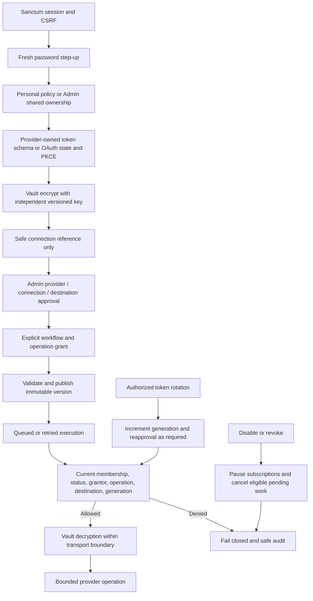

# Credential and authorization flow

```mermaid
flowchart TD
  Login[Sanctum session and CSRF] --> Step[Fresh password step-up]
  Step --> Policy[Personal policy or Admin shared ownership]
  Policy --> Cred[Provider-owned token schema or OAuth state and PKCE]
  Cred --> Vault[Vault encrypt with independent versioned key]
  Vault --> Metadata[Safe connection reference only]
  Metadata --> Approve[Admin provider / connection / destination approval]
  Approve --> Grant[Explicit workflow and operation grant]
  Grant --> Publish[Validate and publish immutable version]
  Publish --> Job[Queued or retried execution]
  Job --> Recheck[Current membership, status, grantor, operation, destination, generation]
  Recheck -->|Allowed| Decrypt[Vault decryption within transport boundary]
  Recheck -->|Denied| Block[Fail closed and safe audit]
  Decrypt --> Send[Bounded provider operation]
  Rotate[Authorized token rotation] --> Generation[Increment generation and reapproval as required]
  Generation --> Recheck
  Revoke[Disable or revoke] --> Pause[Pause subscriptions and cancel eligible pending work]
  Pause --> Block
```

Connection ownership does not imply permission for every member or workflow to use it. Key rotation is separate from provider token rotation.
