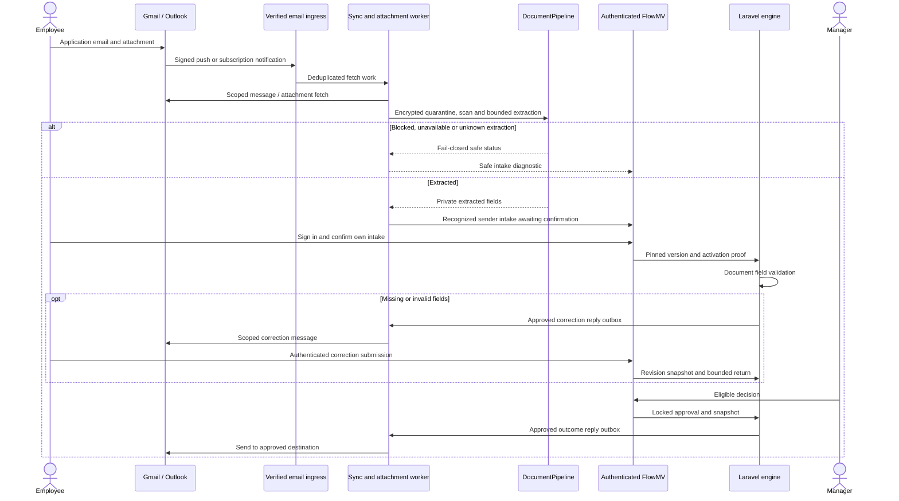

# Email and document processing

```mermaid
sequenceDiagram
  actor Employee
  participant Provider as Gmail / Outlook
  participant Ingress as Verified email ingress
  participant Worker as Sync and attachment worker
  participant Docs as DocumentPipeline
  participant App as Authenticated FlowMV
  participant Engine as Laravel engine
  actor Manager
  Employee->>Provider: Application email and attachment
  Provider->>Ingress: Signed push or subscription notification
  Ingress->>Worker: Deduplicated fetch work
  Worker->>Provider: Scoped message / attachment fetch
  Worker->>Docs: Encrypted quarantine, scan and bounded extraction
  alt Blocked, unavailable or unknown extraction
    Docs-->>Worker: Fail-closed safe status
    Worker-->>App: Safe intake diagnostic
  else Extracted
    Docs-->>Worker: Private extracted fields
    Worker->>App: Recognized sender intake awaiting confirmation
    Employee->>App: Sign in and confirm own intake
    App->>Engine: Pinned version and activation proof
    Engine->>Engine: Document field validation
    opt Missing or invalid fields
      Engine->>Worker: Approved correction reply outbox
      Worker->>Provider: Scoped correction message
      Employee->>App: Authenticated correction submission
      App->>Engine: Revision snapshot and bounded return
    end
    Manager->>App: Eligible decision
    App->>Engine: Locked approval and snapshot
    Engine->>Worker: Approved outcome reply outbox
    Worker->>Provider: Send to approved destination
  end
```

In the showcase the internal processing and DOCX parser are real; provider responses and scanner results are simulated.
