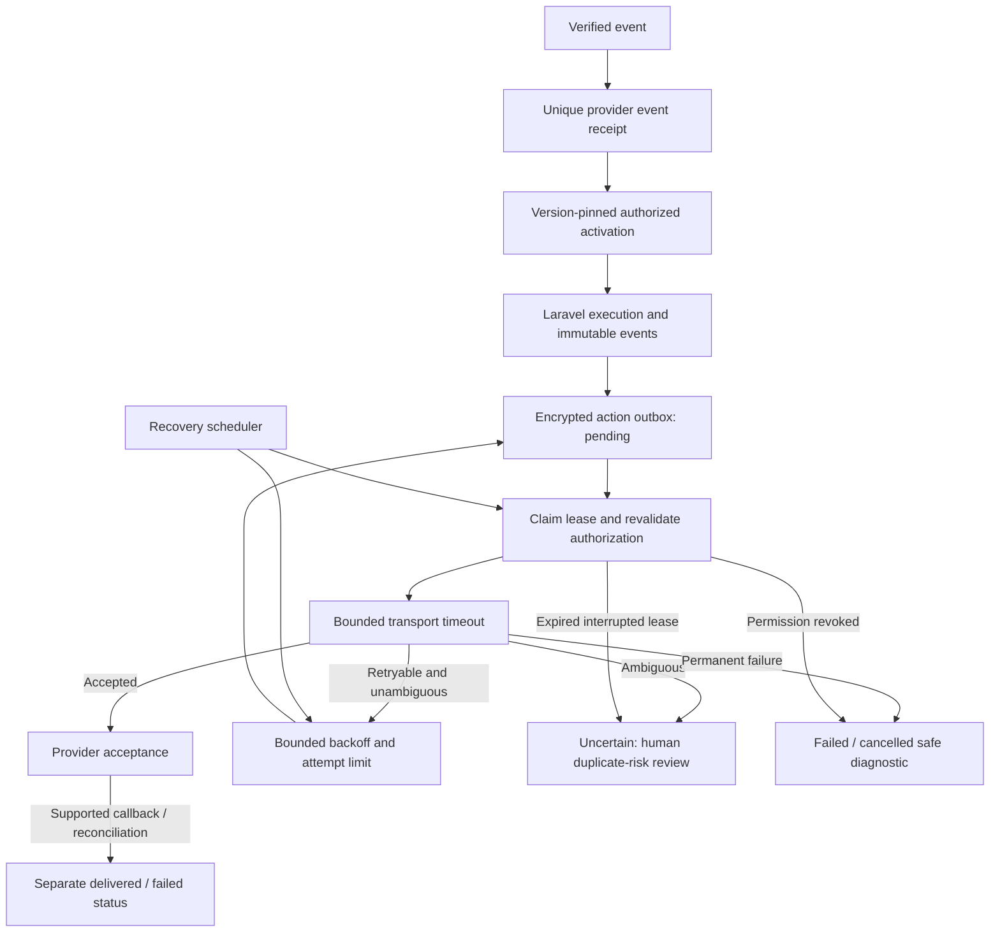

# Durable delivery and recovery

```mermaid
flowchart TD
  Event[Verified event] --> Unique[Unique provider event receipt]
  Unique --> Subscription[Version-pinned authorized activation]
  Subscription --> Engine[Laravel execution and immutable events]
  Engine --> Pending[Encrypted action outbox: pending]
  Pending --> Claim[Claim lease and revalidate authorization]
  Claim --> Send[Bounded transport timeout]
  Send -->|Accepted| Accepted[Provider acceptance]
  Send -->|Retryable and unambiguous| Backoff[Bounded backoff and attempt limit]
  Backoff --> Pending
  Send -->|Ambiguous| Uncertain[Uncertain: human duplicate-risk review]
  Send -->|Permanent failure| Failed[Failed / cancelled safe diagnostic]
  Claim -->|Permission revoked| Failed
  Claim -->|Expired interrupted lease| Uncertain
  Accepted -->|Supported callback / reconciliation| Delivery[Separate delivered / failed status]
  Scheduler[Recovery scheduler] --> Backoff
  Scheduler --> Claim
```

Provider guarantees differ. Never infer exactly-once Telegram or email delivery from local deduplication.
