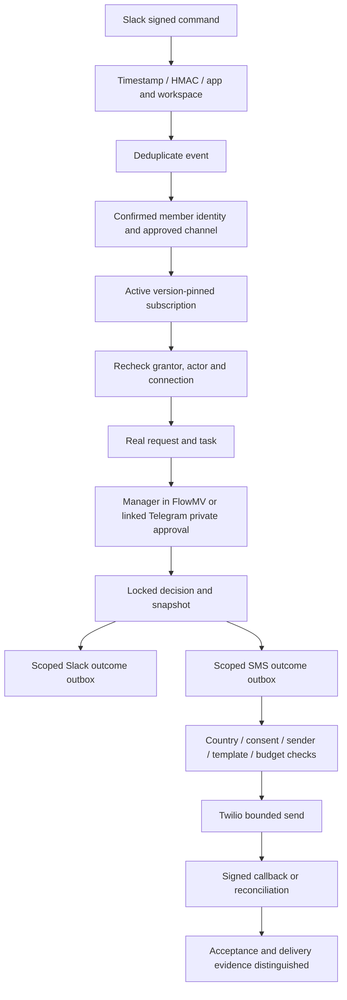

# Slack intake and SMS outcome

```mermaid
flowchart TB
  Slack[Slack signed command] --> Verify[Timestamp / HMAC / app and workspace]
  Verify --> Dedup[Deduplicate event]
  Dedup --> Link[Confirmed member identity and approved channel]
  Link --> Sub[Active version-pinned subscription]
  Sub --> Activate[Recheck grantor, actor and connection]
  Activate --> Request[Real request and task]
  Request --> Human[Manager in FlowMV or linked Telegram private approval]
  Human --> Decision[Locked decision and snapshot]
  Decision --> SlackOut[Scoped Slack outcome outbox]
  Decision --> SMSOut[Scoped SMS outcome outbox]
  SMSOut --> Consent[Country / consent / sender / template / budget checks]
  Consent --> SMS[Twilio bounded send]
  SMS --> Status[Signed callback or reconciliation]
  Status --> Audit[Acceptance and delivery evidence distinguished]
```

The demo uses synthetic provider responses; the same domain actions, permission checks and outbox services run.
