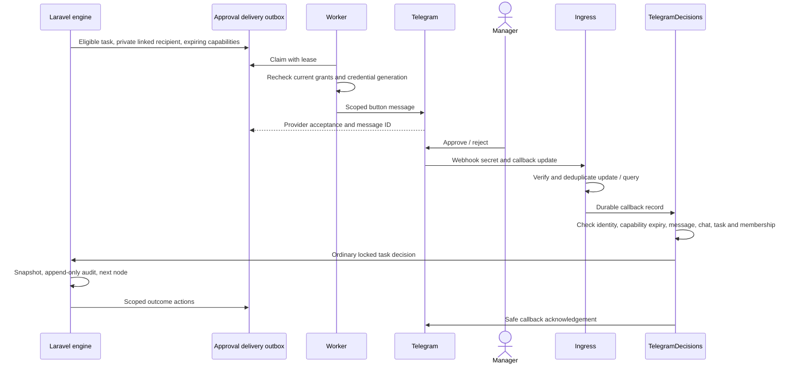

# Telegram interactive decision

```mermaid
sequenceDiagram
  participant Engine as Laravel engine
  participant Outbox as Approval delivery outbox
  participant Worker
  participant Telegram
  actor Manager
  participant Ingress
  participant Decide as TelegramDecisions
  Engine->>Outbox: Eligible task, private linked recipient, expiring capabilities
  Worker->>Outbox: Claim with lease
  Worker->>Worker: Recheck current grants and credential generation
  Worker->>Telegram: Scoped button message
  Telegram-->>Outbox: Provider acceptance and message ID
  Manager->>Telegram: Approve / reject
  Telegram->>Ingress: Webhook secret and callback update
  Ingress->>Ingress: Verify and deduplicate update / query
  Ingress->>Decide: Durable callback record
  Decide->>Decide: Check identity, capability expiry, message, chat, task and membership
  Decide->>Engine: Ordinary locked task decision
  Engine->>Engine: Snapshot, append-only audit, next node
  Engine->>Outbox: Scoped outcome actions
  Decide->>Telegram: Safe callback acknowledgement
```

Buttons cannot authorize an unlinked user, grant internal privileges or override stale permissions. Telegram acceptance is not exactly-once delivery.
