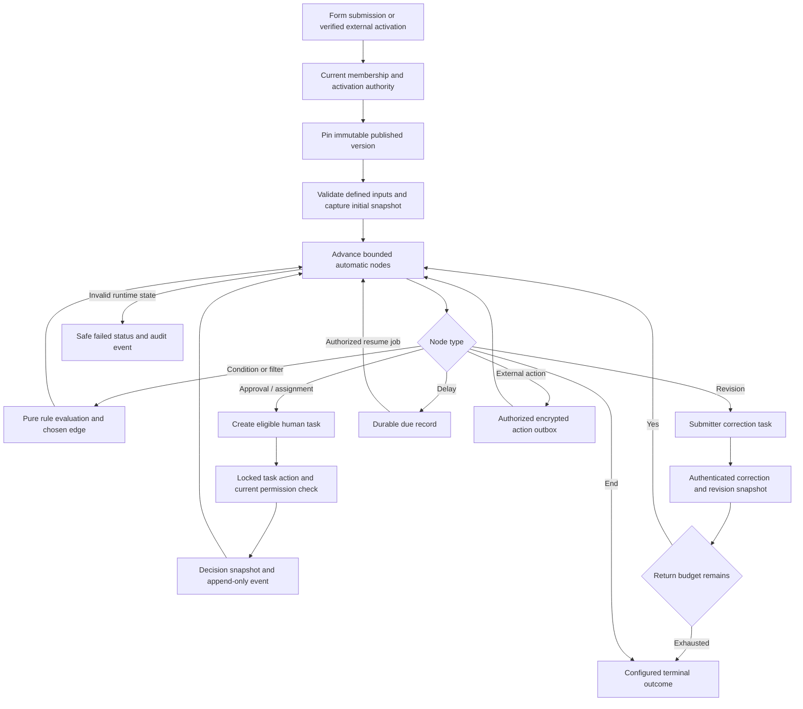

# Workflow execution

```mermaid
flowchart TD
  Trigger[Form submission or verified external activation] --> Gate[Current membership and activation authority]
  Gate --> Pin[Pin immutable published version]
  Pin --> Inputs[Validate defined inputs and capture initial snapshot]
  Inputs --> Run[Advance bounded automatic nodes]
  Run --> Kind{Node type}
  Kind -->|Condition or filter| Branch[Pure rule evaluation and chosen edge]
  Branch --> Run
  Kind -->|Approval / assignment| Task[Create eligible human task]
  Task --> Decision[Locked task action and current permission check]
  Decision --> Snapshot[Decision snapshot and append-only event]
  Snapshot --> Run
  Kind -->|Revision| Rev[Submitter correction task]
  Rev --> Correct[Authenticated correction and revision snapshot]
  Correct --> Limit{Return budget remains}
  Limit -->|Yes| Run
  Limit -->|Exhausted| End[Configured terminal outcome]
  Kind -->|Delay| Due[Durable due record]
  Due -->|Authorized resume job| Run
  Kind -->|External action| Outbox[Authorized encrypted action outbox]
  Outbox --> Run
  Kind -->|End| End
  Run -->|Invalid runtime state| Fail[Safe failed status and audit event]
```

The action outbox has a separate delivery lifecycle. A completed request does not guarantee recipient delivery.
